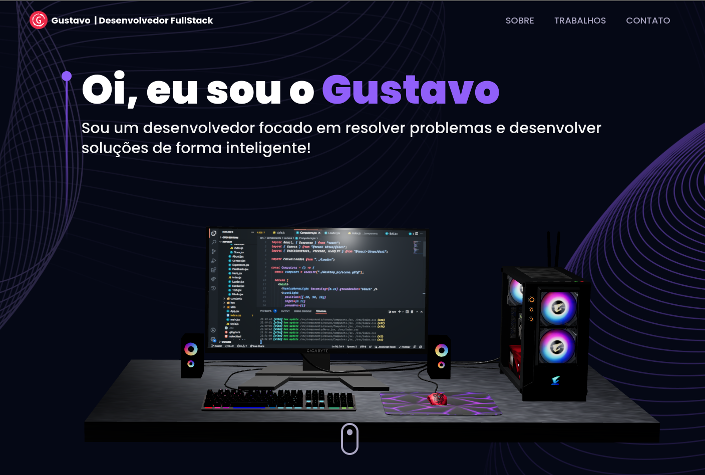
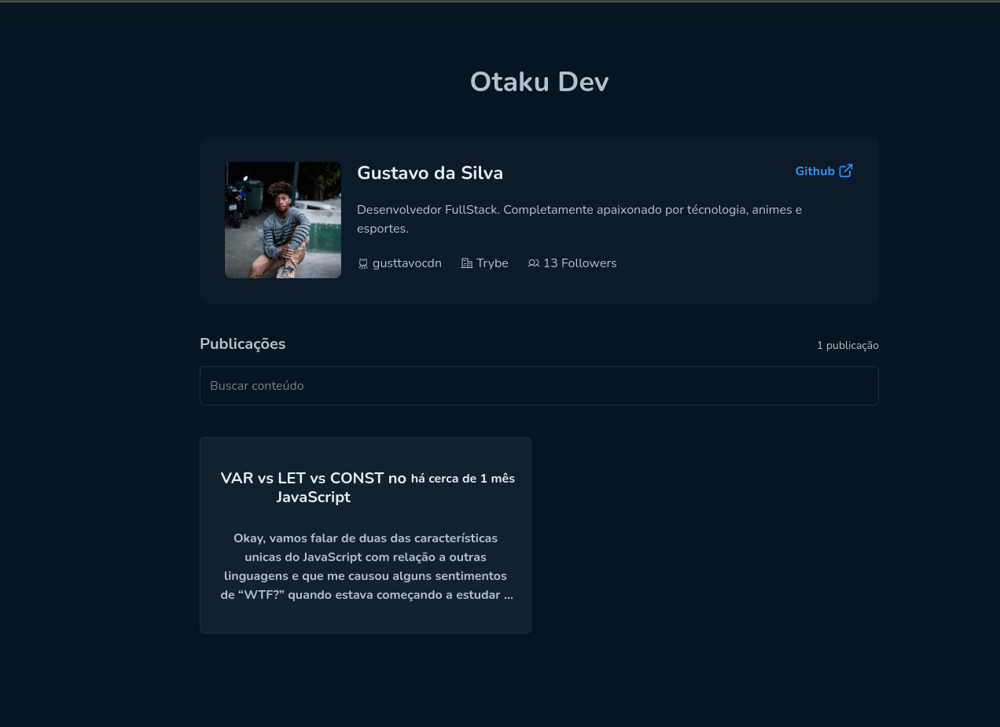
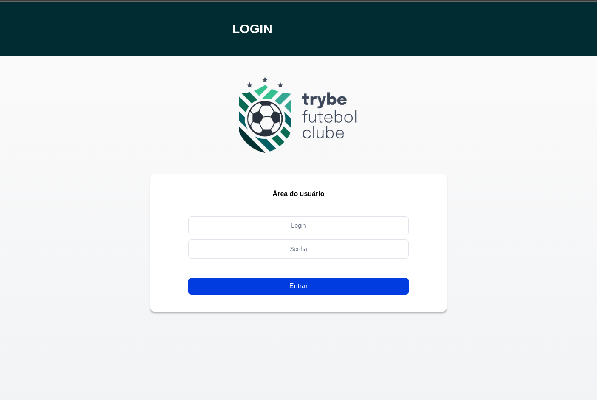
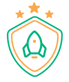
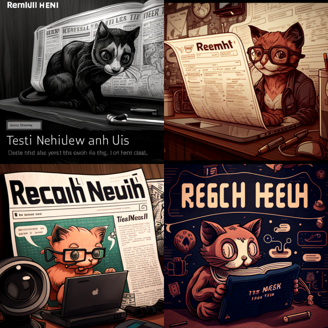

### Hey Guys, I'm Gustavo da Silva 👋

---

###  A Little about me


```javascript
const aboutMe = {
  name: 'Gustavo da Silva',
  age: 24,
  languanges: ["English", "Portuguese"].
  architecture: ["Clean-Architecture", "Domain Driver Design", "TDD"],
  softSkills: [
    'fast-learner',
    'organization',
    'proactivity',
    'leadership',
  ],
  programmingLanguages: ['JavaScript', 'TypeScript', 'C', 'Python', 'ShellScript'],
  tools: ['Express', 'Nest', 'Styled-Components', 'Jest', 'Docker', 'React' 'React-Native', 'Cypress', 'Next', 'Redux'],
  databases: ['MySQL', 'Postgres', 'Mongo'],
}
```

<br>
:us:
<p>Full-Stack Developer. I am currently finishing the Computer Science module of the <a href="https://www.betrybe.com/">Trybe course</a>. In parallel, I also act as a Summer Instructor at Trybe, assisting with complementary classes for younger classes. I am an extremely curious and engaged person with the world of technology. A nerd who loves playing video games, basketball, reading (books, manga and comics) and listening to podcasts. I have great ease in understanding and solving problems that require logical reasoning, organization and research.</p>
:brazil:
<p>Desenvolvedor Full-Stack. Estou atualmente terminando o módulo de Ciências da Computação do curso da  <a href="https://www.betrybe.com/">Trybe</a>. Em parelolo tambem atúo como Summer de Instrução na mesma, auxliando com aulas complementares para turmas mais novas.
Sou uma pessoa extremamente curiosa e engajada com o mundo da tecnologia. Um nerd que ama jogar video-game, basquete, ler (livros, mangas e hqs) e ouvir podcasts. Tenho muita facilidade em entender e solucionar problemas que precisem de raciocínio lógico, organização e pesquisa.</p>
<br>

<h2 align="center"> Social Media</h2>
<br>

  <div align="center"> 
  <a href="https://www.instagram.com/gusttavocdn/" target="_blank"></a>
 <a href="https://discord.com/channels/@me" target="_blank"></a> 
  <a href = "mailto:gusttavo.x.santos@gmail.com"></a>
  <a href="https://www.linkedin.com/in/gustavo-silva-750860140/" target="_blank"></a>

<br>

<h2 align="center">Code Wars</h2>
<br>

<br>
<br>

 <div align="center">
  <a href="https://github.com/GusttavoCDN">
  
  z
</div>
<br>
  
  <!--START_SECTION:waka-->


**I'm an Early 🐤** 

```text
🌞 Morning                38 commits          █░░░░░░░░░░░░░░░░░░░░░░░░   05.86 % 
🌆 Daytime                366 commits         ██████████████░░░░░░░░░░░   56.39 % 
🌃 Evening                179 commits         ███████░░░░░░░░░░░░░░░░░░   27.58 % 
🌙 Night                  66 commits          ███░░░░░░░░░░░░░░░░░░░░░░   10.17 % 
```


📊 **This Week I Spent My Time On** 

```text
💬 Programming Languages: 
TypeScript               4 hrs 52 mins       ███████████████████░░░░░░   76.89 % 
Markdown                 52 mins             ███░░░░░░░░░░░░░░░░░░░░░░   13.88 % 
Bash                     22 mins             █░░░░░░░░░░░░░░░░░░░░░░░░   05.84 % 
JSON                     12 mins             █░░░░░░░░░░░░░░░░░░░░░░░░   03.20 % 
JavaScript               0 secs              ░░░░░░░░░░░░░░░░░░░░░░░░░   00.18 % 

🐱‍💻 Projects: 
computer_science_ts      5 hrs 58 mins       ████████████████████████░   94.16 % 
Unknown Project          22 mins             █░░░░░░░░░░░░░░░░░░░░░░░░   05.84 % 
```


<!--END_SECTION:waka-->

<br>

<h1 align="center">42SP Projects</h1>
<br>

<table align="center">
  <tr>
    <td valign="top" width="50%">
      <h2 align="center">Born2beroot</h2>
      <a></a>
      <p><em><strong>:wrench: Ferramentas:</strong> VirtualBox, C, ShellScript, Debian</em></p>
      <p>
        <a href="https://github.com/GusttavoCDN/born2beroot">Repositorio</a>
      </p>   
    </td>
     <td valign="top" width="50%">
      <h2 align="center">FT_PRINTF </h2>
      <a></a>
      <p><em><strong>:wrench: Ferramentas: </strong> C, Makefile</em></p>
      <p>
        <a href="https://github.com/gusttavocdn/42_ft_printf">Repositorio</a>
      </p>   
    </td>
  </tr>
   <tr>
    <td valign="top" width="50%">
      <h2 align="center">Get Next Line</h2>
      <a></a>
      <p><em><strong>:wrench: Ferramentas:</strong> C, Makefile</em></p>
      <p>
        <a href="https://github.com/GusttavoCDN/42_get_next_line">Repositorio</a>
      </p>   
    </td>
     <td valign="top" width="50%">
      <h2 align="center">LIBFT</h2>
      <a></a>
      <p><em><strong>:wrench: Ferramentas: </strong>C, Makefile</em></p>
      <p>
        <a href="https://github.com/gusttavocdn/42_libft">Repositorio</a>
      </p>   
    </td>
  </tr>
</table>

<h1 align="center">Projects</h1>
<br>

<table align="center">
  <tr>
    <td valign="top" width="50%">
      <h2 align="center">Portfolio</h2>
      <a></a>
      <p><em><strong>:wrench: Ferramentas:</strong>React, Typescript, tree.js</em></p>
      <p>
        <a href="https://github.com/gusttavocdn/my_portfolio">Repositorio</a>
      </p>   
    </td>
    <td valign="top" width="50%">
      <h2 align="center">Otaku Blog</h2>
      <a></a>
      <p><em><strong>:wrench: Ferramentas:</strong>React, GithubAPI, Typescript, Axios</em></p>
      <p>
        <a href="https://github.com/gusttavocdn/otaku_dev_blog">Repositorio</a>
      </p>   
    </td>
  </tr>
  <tr>
    <td valign="top" width="50%">
      <h2 align="center">Trybe Futebol Clube</h2>
      <a></a>
      <p><em><strong>:wrench: Ferramentas:</strong>Typescript, Clean-Arch, JWT, Postgres, Sequelize</em></p>
      <p>
        <a href="https://github.com/gusttavocdn/trybe_futebol_clube">Repositorio</a>
      </p>   
    </td>
    <td valign="top" width="50%">
      <h2 align="center">Habits Tracker</h2>
      <a></a>
      <p><em><strong>:wrench: Ferramentas:</strong>React, React-Native, Typescript, Fastify, Prisma</em></p>
      <p>
        <a href="https://github.com/gusttavocdn/habits_tracker">Repositorio</a>
      </p>   
    </td>
  </tr>
  <tr>
    <td valign="top" width="50%">
      <h2 align="center">Teams</h2>
      <a></a>
      <p><em><strong>:wrench: Ferramentas:</strong> React Native, Typescript, Async Storage, Expo, Styled-components</em></p>
      <p>
        <a href="https://github.com/gusttavocdn/teams">Repositorio</a>
      </p>   
    </td>
    <td valign="top" width="50%">
      <h2 align="center">Ignite Gym</h2>
      <a></a>
      <p><em><strong>:wrench: Ferramentas:</strong> React Native, Typescript, Async Storage, Expo, Styled-components</em></p>
      <p>
        <a href="https://github.com/gusttavocdn/ignite_gym">Repositorio</a>
      </p>   
    </td>
  </tr>
  <tr>
  <td valign="top" width="50%">
      <h2 align="center">Tech News</h2>
      <a></a>
      <p><em><strong>:wrench: Ferramentas:</strong> Python, Pytest, BeatifulSoup</em></p>
      <p>
        <a href="https://github.com/gusttavocdn/tech_news">Repositorio</a>
      </p>   
    </td>
  </tr>
</table>
